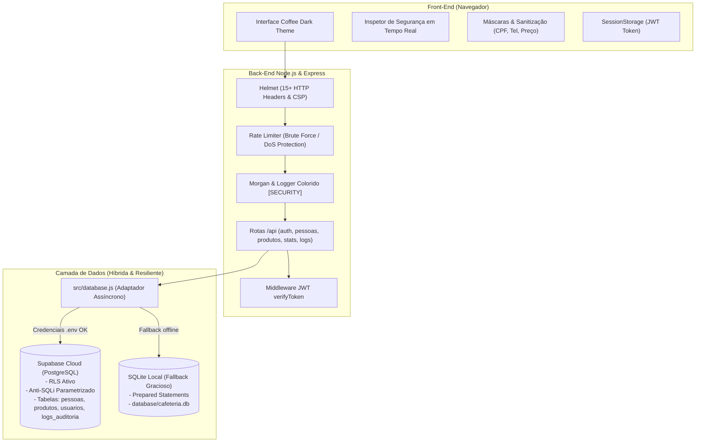

# ☕ Café Artesanal — Sistema de Gestão com Foco em Segurança da Informação & UX

> **Disciplina**: Segurança em Sistemas da Informação  
> **Instituição**: Faculdade Imaculada Conceição do Recife (FICR)  
> **Stack**: Node.js, Express, Supabase (PostgreSQL Cloud), SQLite (Fallback Local), JWT, bcryptjs, Helmet, Morgan, Vanilla HTML5/CSS3/JS.

---

## 📌 Visão Geral do Projeto

O **Café Artesanal** é uma aplicação web completa voltada para a gestão de **Pessoas** (Clientes VIP, Funcionários e Baristas) e **Produtos** (Grãos, Bebidas Quentes, Geladas, Lanches e Sobremesas) de uma cafeteria gourmet.

O objetivo central do projeto é aplicar os conceitos e boas práticas de **Segurança em Sistemas da Informação (SSI)** tanto no **Front-End** quanto no **Back-End** e na camada de **Banco de Dados**, implementando o princípio de **Defesa em Profundidade (*Defense in Depth*)** alinhado às recomendações do **OWASP Top 10**.

---

## 🛡️ Matriz de Segurança Implementada

| Camada | Artefato de Segurança | Tecnologia | Objetivo / Mitigação |
|---|---|---|---|
| **Front-End** | Limite de Caracteres (`maxlength`) | HTML5 + JS | Prevenção de Buffer Overflow e contenção de Payload Flooding |
| **Front-End** | Campos Obrigatórios (`required`) | HTML5 + JS | Consistência de estado da aplicação antes do envio |
| **Front-End** | Máscaras de Entrada (CPF, Telefone, R$) | Vanilla JS (Módulo 11) | Sanitização de dados, anti-XSS e bloqueio de caracteres especiais |
| **Front-End** | Tipagem Rigorosa de Inputs | HTML5 Engine | Validação prévia de formato (`email`, `number`, `tel`) |
| **Front-End** | Inspetor de Segurança em Tempo Real | Sidebar Dinâmica | Demonstração educacional interativa de cada regra ativa |
| **Front-End** | Escapamento de Caracteres | Função `escapeHtml()` | Prevenção de Stored XSS na renderização do DOM |
| **Back-End** | Autenticação Stateless JWT | `jsonwebtoken` (HS256) | Proteção de rotas restritas de escrita e deleção (expiração de 2h) |
| **Back-End** | Criptografia de Senhas com Salt | `bcryptjs` (Cost 10) | Proteção contra ataques de dicionário e *rainbow tables* |
| **Back-End** | Controle de Acesso Baseado em Papéis | RBAC (`role`) | Separação de privilégios (`administrador` e `gerente`) |
| **Back-End** | Rate Limiting Granular | `express-rate-limit` | Prevenção contra Força Bruta (login: 5/15min) e DoS de escrita |
| **Back-End** | Cabeçalhos HTTP Seguros | `helmet` | CSP, X-Frame-Options (anti-clickjacking), HSTS, MIME Sniffing |
| **Back-End** | Auditoria e Logs Coloridos | `morgan` + Logger Próprio | Rastreabilidade e detecção de incidentes (`[SECURITY]`, `[WARN]`, etc.) |
| **Back-End** | Proteção de Credenciais | `dotenv` + `.gitignore` | Chaves de API e segredos isolados do controle de versão Git |
| **Banco** | Prevenção contra SQL Injection | Supabase SDK / Prepared Stmts | Queries parametrizadas: dados nunca são executados como código |
| **Banco** | Row Level Security (RLS) | PostgreSQL Policies | Controle granular de acesso em nível de linha no Supabase |
| **Banco** | Trilha Forense de Auditoria | Tabela `logs_auditoria` | Registro persistente de acessos, erros e eventos de segurança |
| **Banco** | Validação no Banco de Dados | *CHECK Constraints* | Validações de comprimento e valores positivos no nível do SGBD |

---

## 🏗️ Arquitetura do Sistema



---

## 🗄️ Estrutura do Banco de Dados

O projeto conta com **4 tabelas estruturadas** com regras de integridade e segurança:

1. **`pessoas`**: Cadastro de clientes e funcionários da cafeteria.
   * Restrições de tamanho (*CHECK*) em `nome (80)`, `cpf (14)`, `email (100)` e `telefone (15)`.
2. **`produtos`**: Catálogo de produtos e controle de estoque.
   * Restrições: `preco > 0`, `estoque >= 0`, `sku UNIQUE (20)` e `nome (70)`.
3. **`usuarios`**: Operadores do sistema com controle de acesso (RBAC).
   * Armazena `username`, `password_hash` (hash bcrypt), `role` e `nome`.
4. **`logs_auditoria`**: Trilha forense permanente de eventos de segurança.
   * Registra `nivel`, `mensagem`, `detalhes` (JSONB), `ip`, `operador` e `data_hora`.

---

## 🔑 Credenciais de Acesso (Demonstração Acadêmica)

| Usuário | Senha | Perfil (Role) | Permissões |
|---|---|---|---|
| `admin` | `cafe@2025` | `administrador` | Leitura, escrita, exclusão e auditoria |
| `gerente` | `espresso123` | `gerente` | Leitura, escrita e exclusão |

*As senhas estão criptografadas no banco via hash **bcrypt** com salt rounds = 10.*

---

## 🚀 Como Executar o Projeto

### Pré-requisitos
- **Node.js** v18 ou superior instalado.
- Conta no **Supabase** (opcional: caso não configure, o sistema opera automaticamente em modo local via SQLite).

---

### Passo 1: Clonar e Instalar Dependências

No terminal Git Bash ou PowerShell:

```bash
# Entrar no diretório do projeto
cd Seguranca_em_Sistemas_da_Informacao_FICR

# Instalar as dependências
npm install
```

---

### Passo 2: Configurar o Ambiente (.env)

O arquivo `.env` já vem pré-configurado. Se desejar conectar à sua própria conta do Supabase:

1. Acesse [supabase.com](https://supabase.com) e crie um projeto.
2. No menu lateral, acesse **SQL Editor** e execute o script [`database/supabase_schema.sql`](database/supabase_schema.sql).
3. Vá em **Project Settings > API** e copie a URL e a Chave de API.
4. Preencha no arquivo `.env`:
   ```env
   PORT=3000
   JWT_SECRET=cafe_artesanal_super_secret_jwt_key_2025_ficr_seguranca
   SUPABASE_URL=https://seuid.supabase.co
   SUPABASE_KEY=sua-chave-api-aqui
   ```

> 💡 **Fallback Automático**: Se você não configurar chaves reais no `.env`, o sistema detectará isso e ativará automaticamente o banco **SQLite local**, garantindo que tudo funcione perfeitamente sem falhas.

---

### Passo 3: Iniciar o Servidor

```bash
npm run dev
```

Você verá o banner e os logs de segurança no terminal:

```text
╔══════════════════════════════════════════════════════════╗
║  ☕  CAFÉ ARTESANAL — BACK-END SEGURO                     ║
║  🛡️   Segurança em Sistemas da Informação — FICR          ║
╚══════════════════════════════════════════════════════════╝

[SUCCESS ] ✅ Servidor rodando em http://localhost:3000
[INFO    ] 📋 Banco de Dados:  → Driver=Supabase (PostgreSQL Cloud)
[INFO    ] 📋 Artefatos de Segurança Ativos:  → Banco=Supabase | RBAC_Usuarios=ON | Trilha_Auditoria=ON | Terminal_Logs=ON | Helmet=ON | Morgan=ON | RateLimit=ON | JWT=ON | DotenvSecretManagement=ON
```

---

### Passo 4: Acessar a Aplicação

Abra o navegador e acesse:
```
http://localhost:3000
```

---

## 📡 Endpoints da API REST

| Método | Endpoint | Protegido por JWT? | Descrição |
|---|---|:---:|---|
| `POST` | `/api/auth/login` | Não (Rate Limit 5/15m) | Autentica operador e retorna token JWT |
| `POST` | `/api/auth/logout` | Não | Registra auditoria de logout |
| `GET` | `/api/pessoas` | Não | Retorna listagem de clientes/funcionários |
| `POST` | `/api/pessoas` | **Sim** (`Bearer Token`) | Cadastra nova pessoa com validações de SSI |
| `DELETE` | `/api/pessoas/:id` | **Sim** (`Bearer Token`) | Remove pessoa pelo ID |
| `GET` | `/api/produtos` | Não | Retorna catálogo de produtos |
| `POST` | `/api/produtos` | **Sim** (`Bearer Token`) | Cadastra novo produto (valida SKU único) |
| `DELETE` | `/api/produtos/:id` | **Sim** (`Bearer Token`) | Remove produto pelo ID |
| `GET` | `/api/stats` | Não | Estatísticas de pessoas, produtos e estoque |
| `GET` | `/api/logs-auditoria` | Não | Retorna os últimos 50 eventos da trilha forense |
| `GET` | `/api/security-info` | Não | Painel informativo de todos os artefatos ativos |

---

## 📁 Estrutura de Diretórios do Projeto

```
Seguranca_em_Sistemas_da_Informacao_FICR/
├── .env                           # Variáveis de ambiente locais (ignorado no Git)
├── .env.example                   # Modelo seguro de variáveis de ambiente
├── .gitignore                     # Proteção de credenciais e arquivos temporários
├── package.json                   # Dependências e scripts npm
├── server.js                      # Ponto de entrada do servidor Node.js com Express
│
├── database/
│   ├── supabase_schema.sql        # Script DDL com tabelas, RLS e seeds para Supabase
│   └── cafeteria.db               # Base local SQLite para modo fallback
│
├── src/
│   ├── database.js                # Camada unificada de dados (Supabase + fallback SQLite)
│   ├── logger.js                  # Logger com saídas coloridas no terminal
│   │
│   ├── middlewares/
│   │   ├── auth.js                # Validação de token JWT (formato, expiração, assinatura)
│   │   └── rateLimiter.js         # Limitadores de taxa (login, geral e escrita)
│   │
│   └── routes/
│       ├── auth.js                # Rota de login, bcrypt e emissão de JWT
│       ├── pessoas.js             # Rotas CRUD de pessoas com validações e logs
│       └── produtos.js            # Rotas CRUD de produtos com validações e logs
│
└── public/                        # Front-End (Vanilla Web)
    ├── index.html                 # Estrutura semântica, formulários e modal JWT
    ├── css/
    │   └── style.css              # Tema Coffee Dark, glassmorphism e animações
    └── js/
        ├── app.js                 # Lógica de interface, consumo da API e JWT
        ├── masks.js               # Máscaras de entrada (CPF com Dígito Verificador, Tel)
        └── validation.js          # Validações client-side e Inspetor de Segurança
```

---

## 👥 Equipe & Disciplina

* **Instituição**: Faculdade Imaculada Conceição do Recife (FICR)
* **Curso**: Sistemas de Informação / Ciência da Computação
* **Disciplina**: Segurança em Sistemas da Informação
* **Ano Letivo**: 2025 / 2026
